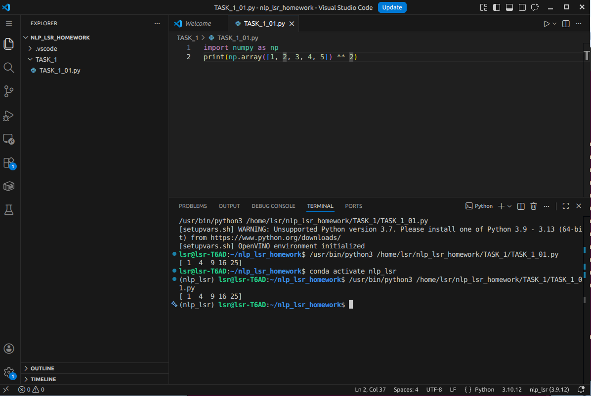

# lsr的自我介绍


大家好，我是**李姝蓉**，我的身份是*机器人野狼队视觉算法组主力队员 24人工智能1班班长  辅导员助理*。以下是我的自我介绍：

---

## 基础档案

### 外貌特征

- 猫猫嘴

## 我的好朋友

1. 龙城F4

### 重要坐标

住址：[GCU](https://onepiece.fandom.com/wiki/Thousand_Sunny)

### 日常作息表

| 时间段 | 活动 |
|--------|------|
| 09:30 - 12:00 | 机器人野狼队实验室 调车/学习 |
| 12:00 - 13:00 | 觅食 |
| 13:00 - 18:00 | 机器人野狼队实验室 调车/学习 |
| 18:00 - 19:00 | 觅食 |
| 19:00 - 22:00 | 机器人野狼队实验室 调车/学习 |
| 22:00 - 24:00 | 收拾 整理内务 |
| 24:00 - 02:00 | 偷玩 |

### 人生信条

> 静而不争 稳而不语


---

## 我的专业是人工智能


## 我最喜欢的一段代码

```python
import numpy as np

# 三维空间中的点云旋转变换（绕 Z 轴旋转 θ 角）
def rotate_point_cloud(points, theta):
    """
    points: (N, 3) 的 numpy 数组，表示 N 个三维空间点
    theta : 旋转角度（弧度）
    """
    R = np.array([
        [ np.cos(theta), -np.sin(theta), 0],
        [ np.sin(theta),  np.cos(theta), 0],
        [             0,              0, 1]
    ])
    return points @ R.T

# 示例：4 个空间点绕 Z 轴旋转 45°
points = np.array([
    [1.0, 0.0, 0.5],
    [0.0, 1.0, 1.0],
    [1.0, 1.0, 0.0],
    [0.5, 0.5, 0.5],
])
rotated = rotate_point_cloud(points, theta=np.pi / 4)
print("旋转后的点云：\n", np.round(rotated, 4))
```

其中执行 `rotate_point_cloud(points, theta=np.pi / 4)` 可将点云绕 Z 轴旋转 45°，输出变换后的三维坐标。

我可以在IDE上使用我建立的虚拟环境


